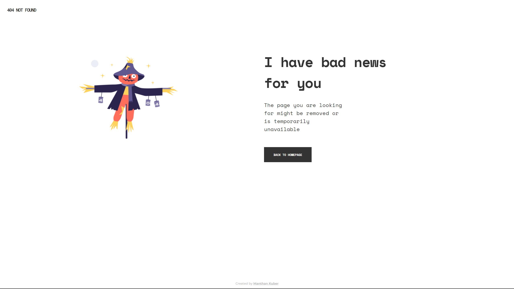
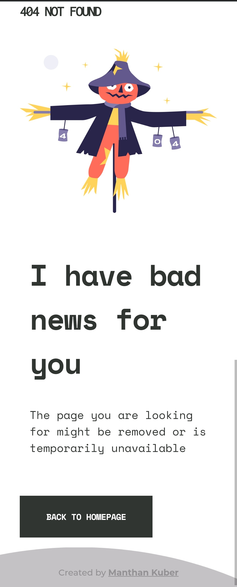

<!-- Please update value in the {}  -->

<h1 align="center">404 Page</h1>

   Solution for a challenge from  <a href="http://devchallenges.io" target="_blank">Devchallenges.io</a>.

  <h3>
    <a href="https://manthan-kuber.github.io/404-Page/">
      Live Demo
    </a>
     | 
    <a href="https://devchallenges.io/challenges/wBunSb7FPrIepJZAg0sY">
      Challenge
    </a>
  </h3>

<!-- TABLE OF CONTENTS -->

## Table of Contents

- [Screenshots](#screenshots)
- [Contact](#contact)

<!-- OVERVIEW -->

## Screenshots

Desktop Screenshot

Mobile Screenshot

This application/site was created as a submission to a [DevChallenges](https://devchallenges.io/challenges) challenge. The [challenge](https://devchallenges.io/challenges/wBunSb7FPrIepJZAg0sY) was to build an application to complete the given user stories.

## Contact

- GitHub [@Manthan-Kuber](https://{github.com/Manthan-Kuber})

